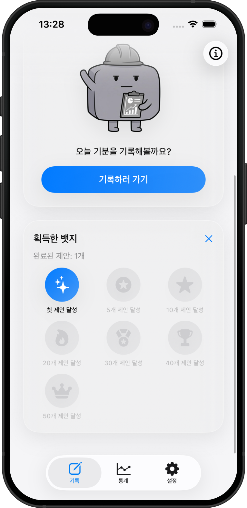
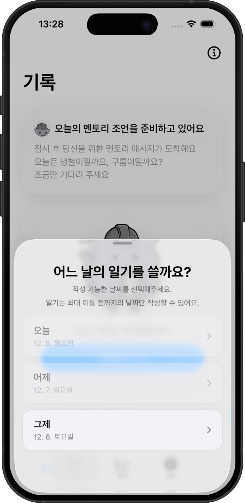
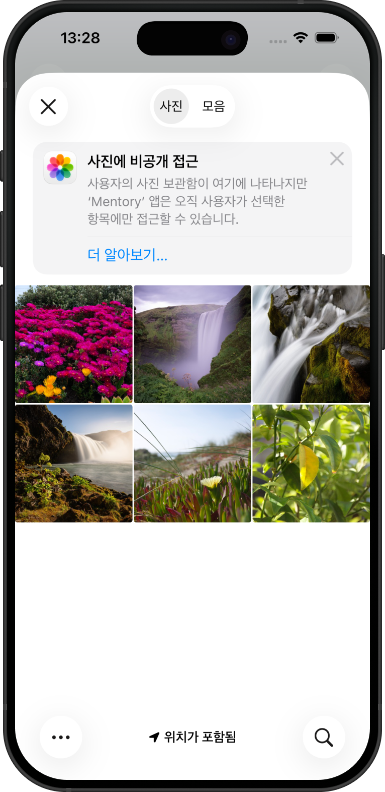
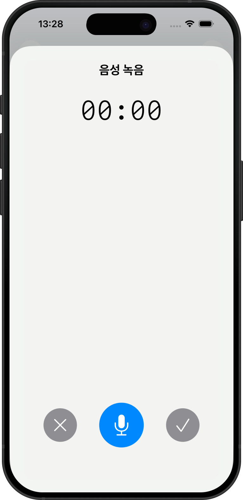
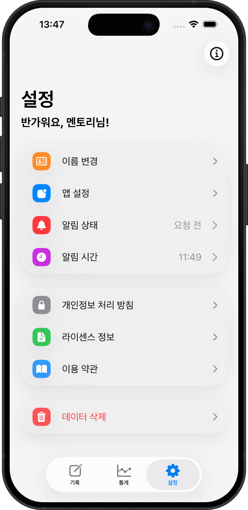

<!-- 프로젝트 개요 -->

<div align="center">
  <a href="https://github.com/EST-iOS4/Mentory">
    
  </a>

  <h3>Mentory</h3>

  <p>
    감정을 기록하면 LLM이 분석해 맞춤 행동을 제안하는 SwiftUI 멘탈케어 앱
  </p>

  <p>
    
    
    
  </p>

  <p>
    
    
    
  </p>
</div>

<p align="center">
  
</p>

## Overview

Mentory는 감정 기록을 일회성 다이어리가 아닌 "분석 가능한 데이터"로 다뤄, 사용자 입력(텍스트/음성/이미지)을 SwiftData에 축적하고 LLM 분석 결과를 행동 제안으로 연결하는 iOS 앱입니다. 이 프로젝트는 기능 구현 자체보다도 SwiftUI + Combine + Swift Concurrency를 조합해 테스트 가능한 아키텍처로 설계하고, iOS/Watch/Widget까지 확장 가능한 구조를 구축하는 데 초점을 두었습니다.

## Tech Stack

- UI: SwiftUI
- State & Reactive: Combine
- Concurrency: Swift Concurrency (async/await)
- Local Persistence: SwiftData
- Build System: Tuist
- AI/LLM: Alan API, Firebase AI Logic
- Platform Extensions: WatchConnectivity, WidgetKit

## Portfolio Highlights

- Domain/Presentation/Adapter/Service 계층 분리로 변경 영향 최소화
- Adapter 인터페이스 기반 테스트 가능한 구조
- Combine + async/await 혼합 사용으로 UI 반응성과 비동기 처리 분리
- SwiftData를 통한 로컬 데이터 중심 기록/조회 파이프라인 구성
- iOS 앱 중심의 Watch/Widget 연동 확장 구조 설계

## Architecture

### Layered Structure & Dependency Direction

- Layer: `Domain` / `Presentation` / `Adapter` / `Service`
- 의존성 방향: Presentation → Domain, Domain → Protocol, Adapter → Protocol 구현
- 상세 설계 의도와 트레이드오프는 아래 섹션에서 보강합니다.

## Data Flow

- 감정 기록 생성 → 저장(SwiftData) → 분석 요청(LLM async) → 제안 생성 → UI 반영
- 상세 데이터 흐름은 아래 섹션에서 보강합니다.

## Testing Strategy

- Adapter 프로토콜 + Mock 구현체 기반으로 Domain 테스트 가능
- 상세 테스트 범위는 아래 섹션에서 보강합니다.

## My Role

- 개인 포트폴리오 관점에서 아키텍처 설계, 데이터 흐름 정의, 모듈 경계 설정, 테스트 기반 설계에 집중했습니다.

## Screenshots

<table>
  <tr>
    <td align="center" width="25%">
      
      <br>
      <b>오늘의 감정 보드</b>
      <br>
      <sub>오늘 하루의 감정 기록</sub>
    </td>
    <td align="center" width="25%">
      
      <br>
      <b>활동 추천</b>
      <br>
      <sub>AI가 추천하는 맞춤형 활동</sub>
    </td>
    <td align="center" width="25%">
      
      <br>
      <b>뱃지</b>
      <br>
      <sub>기록 달성에 따른 뱃지 획득</sub>
    </td>
    <td align="center" width="25%">
      
      <br>
      <b>기록 히스토리</b>
      <br>
      <sub>이틀 전까지 기록 가능</sub>
    </td>
  </tr>
  <tr>
    <td align="center" width="25%">
      
      <br>
      <b>감정 기록 폼</b>
      <br>
      <sub>텍스트, 음성, 사진 기록</sub>
    </td>
    <td align="center" width="25%">
      
      <br>
      <b>사진으로 기록</b>
      <br>
      <sub>이미지를 통한 감정 표현</sub>
    </td>
    <td align="center" width="25%">
      
      <br>
      <b>음성으로 기록</b>
      <br>
      <sub>음성 녹음을 통한 감정 기록</sub>
    </td>
    <td align="center" width="25%">
      
      <br>
      <b>AI 감정 분석</b>
      <br>
      <sub>LLM 기반 감정 분석, 조언</sub>
    </td>
  </tr>
  <tr>
    <td align="center" width="25%">
      
      <br>
      <b>설정</b>
      <br>
      <sub>알림 및 개인 설정 관리</sub>
    </td>
    <td align="center" width="25%"></td>
    <td align="center" width="25%"></td>
    <td align="center" width="25%"></td>
  </tr>
</table>

## Getting Started

> [!NOTE]
> 프로젝트를 빌드하기 위해서는 `Secrets.xcconfig` 와 `GoogleService-Info.plist` 파일이 필요합니다.

### 필요 조건

- Xcode 26.1+
- iOS 26.0+
- watchOS 26.0+
- Swift 6.0
- Tuist

### 설치 방법

1. 저장소 클론
   ```bash
   git clone https://github.com/EST-iOS4/Mentory.git
   cd Mentory
   ```
2. Tuist 설치 및 의존성 동기화
   ```bash
   tuist install
   tuist generate
   ```
3. 워크스페이스 열기
   ```bash
   open mentory.xcworkspace
   ```

### 환경 설정

#### 1) Alan API 토큰 설정

```bash
cp MentoryApp/Secrets.xcconfig.sample MentoryApp/Secrets.xcconfig
```

`MentoryApp/Secrets.xcconfig`

```bash
TOKEN = 여기에-발급받은-토큰-입력
```

#### 2) Firebase 설정

- Firebase Console에서 프로젝트 생성 후 `GoogleService-Info.plist` 다운로드
- `MentoryApp/MentoryApp/`에 파일 추가
- Firebase AI(Gemini API) 활성화

### 실행 방법

- iOS 앱: `Mentory` 스킴 선택 후 Run
- watchOS 앱: `MentoryWatchApp` 스킴 선택 후 Run
- 위젯: 앱 실행 후 홈 화면에서 Mentory 위젯 추가

## Module Structure

```
Mentory/
├── MentoryApp/      # 메인 iOS 앱
├── MentoryDB/       # SwiftData 기반 DB 모듈
├── MentoryDevice/   # Watch/Device 연동 모듈
├── MentoryLLM/      # LLM 연동 모듈
├── MentoryShared/   # 공유 Values/Protocol 모듈
└── assets/          # 문서/이미지 리소스
```

## 팀원

<table>
  <tr>
    <td align="center">
      <a href="https://github.com/dearjaypark">
        <br>
        <b>박재이</b>
      </a>
    </td>
    <td align="center">
      <a href="https://github.com/ji-seok-Song">
        <br>
        <b>송지석</b>
      </a>
    </td>
    <td align="center">
      <a href="https://github.com/funrace2">
        <br>
        <b>구현모</b>
      </a>
    </td>
    <td align="center">
      <a href="https://github.com/mandooplz">
        <br>
        <b>김민우</b>
      </a>
    </td>
  </tr>
  <tr>
    <td align="center">iOS Developer</td>
    <td align="center">iOS Developer</td>
    <td align="center">iOS Developer</td>
    <td align="center">iOS Developer</td>
  </tr>
</table>

## Links

- [작업 진행 상황](https://www.figma.com/board/SiHyXGeXghxikBKJqoxnkh/%EC%A7%84%ED%96%89-%EC%83%81%ED%99%A9?node-id=0-1&t=87sDM1UrF9fC4KOp-1)
