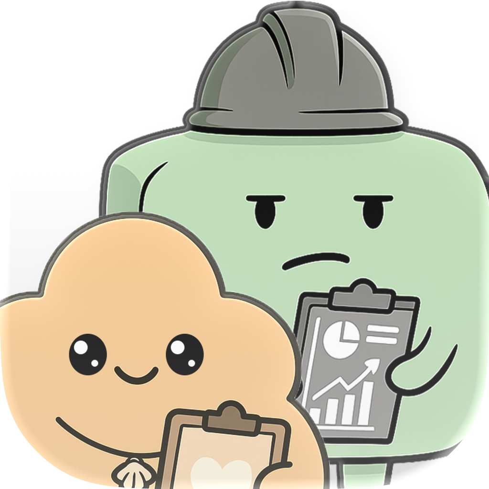
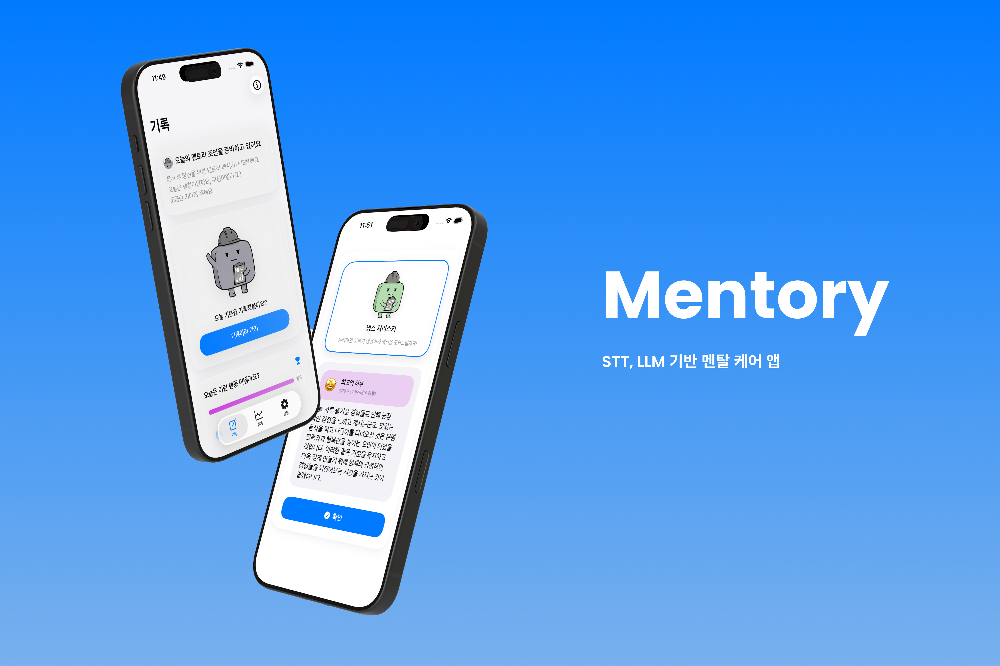
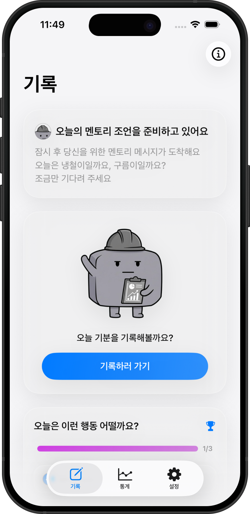
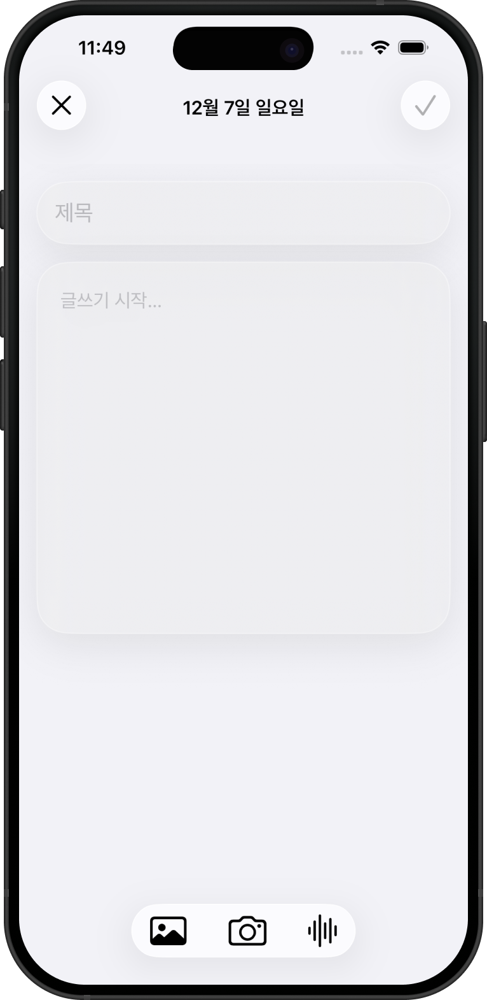
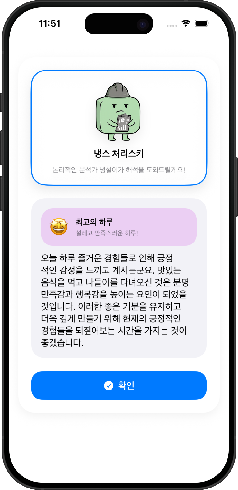
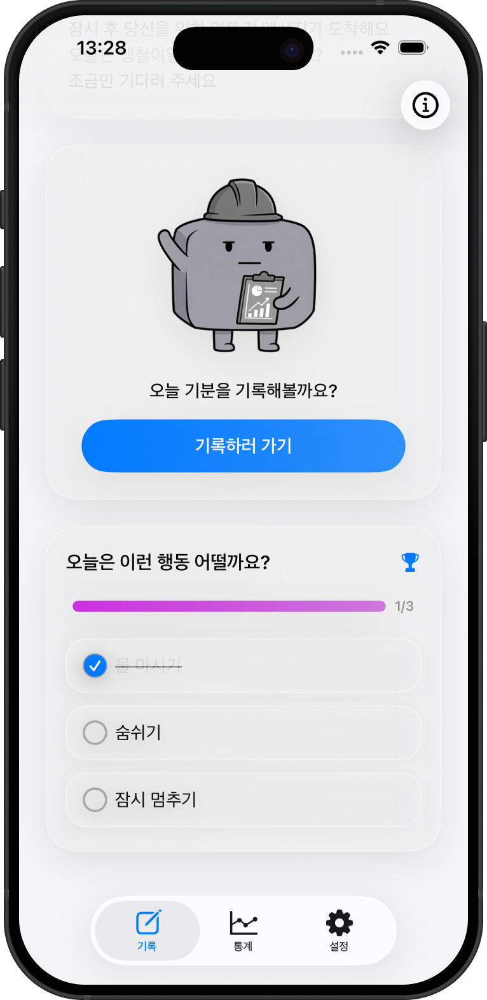

<!-- 프로젝트 개요 -->

<div align="center">
  <a href="https://github.com/EST-iOS4/Mentory">
    
  </a>

  <h3>Mentory</h3>

  <p>
    감정을 기록하면 LLM이 분석해 맞춤 행동을 제안하는 SwiftUI 멘탈케어 앱
  </p>

  <p>
    
    
  </p>

  <p>
    
    
    
  </p>
</div>

<p align="center">
  
</p>

## Overview

Mentory는 감정 기록을 일회성 다이어리가 아닌 "분석 가능한 데이터"로 다뤄, 사용자 입력(텍스트/음성/이미지)을 SwiftData에 축적하고 LLM 분석 결과를 행동 제안으로 연결하는 iOS 앱입니다. 이 프로젝트는 기능 구현 자체보다도 SwiftUI + Combine + Swift Concurrency를 조합해 테스트 가능한 아키텍처로 설계하고, iOS와 Widget 확장까지 고려한 구조를 구축하는 데 초점을 두었습니다.

## Tech Stack

- UI: SwiftUI
- State & Reactive: Combine
- Concurrency: Swift Concurrency (async/await)
- Local Persistence: SwiftData
- Build System: Tuist
- AI/LLM: Alan API, Firebase AI Logic
- Platform Extensions: WidgetKit

## Portfolio Highlights

- `Domain`을 외부 프레임워크 의존에서 분리해 기능 추가 시 핵심 로직 변경 범위를 최소화
- `Adapter Interface` 중심 설계로 LLM/DB 구현체 교체와 테스트 대역(Mock) 주입이 쉬운 구조
- 기록 저장(SwiftData)과 분석 요청(LLM async)을 분리해 실패 지점을 독립적으로 복구 가능
- Combine 스트림(`@Published`)과 async/await를 역할별로 분리해 UI 반응성과 비동기 안정성 확보
- iOS 앱과 Widget 확장을 모듈 경계에서 일관되게 유지
- Tuist 기반 모듈화로 앱/DB/공유 타입/디바이스 연동을 빌드 단위에서 분리

## Architecture

### Layered Structure & Dependency Direction

- Layer: `Presentation` / `Domain` / `Adapter` / `Service`
- Dependency Direction:
  - `Presentation` → `Domain` (유스케이스 소비)
  - `Domain` → `Protocol` (구현이 아닌 추상화 의존)
  - `Adapter`/`Service` → `Protocol 구현` (외부 API, DB, 디바이스 연동)
- DIP(의존성 역전 원칙) 적용으로 Domain은 프레임워크 세부 구현에서 독립적으로 유지됩니다.

왜 이렇게 나눴는가:

- 비즈니스 로직을 View와 분리해 UI 변경(레이아웃/상태 표현)이 핵심 정책에 영향을 주지 않도록 하기 위해
- LLM/DB 같은 외부 의존성 실패를 Adapter 경계에서 캡슐화해 장애 전파를 줄이기 위해
- 같은 Domain 로직을 iOS UI와 Widget 업데이트에서 재사용하기 위해
- 테스트에서 빠른 피드백을 위해 실제 인프라 없이 Domain 단위 검증이 가능해야 했기 때문에

## Data Flow

1. 감정 기록 생성 시나리오
   - 사용자가 `RecordForm`에서 텍스트/음성/이미지를 입력
   - Domain이 입력 검증 후 `MentoryDBInterface`를 통해 SwiftData에 기록 저장
   - 저장된 기록을 기반으로 LLM Adapter에 비동기 분석 요청 (`async/await`)
   - 분석 결과를 `Suggestion`/`MentorMessage`로 변환하여 Domain 상태 갱신
   - `@Published` 상태 변경이 Combine을 통해 SwiftUI View에 반영

2. 재진입/조회 시나리오
   - 앱 재실행 시 SwiftData에서 최근 기록/추천을 로드
   - 로드된 Domain 상태를 Combine 스트림으로 UI에 즉시 반영
   - 필요 시 추가 분석은 async task로 분리해 UI 블로킹 없이 후속 갱신

## Testing Strategy

- 핵심 전략: `Adapter Interface + Mock 구현체`를 사용해 Domain 로직을 외부 인프라 없이 테스트
- 실제 API/DB 호출 없이 상태 전이와 규칙 검증에 집중한 단위 테스트 구성

대표 테스트 대상 및 범위:

- `Onboarding`
  - 입력 검증(공백/유효 입력), 온보딩 완료 상태 전이, 소유자(Domain) 반영 여부
- `TodayBoard`
  - 기록/추천 로드, 상태 업데이트, 재조회 시 중복/순서 안정성
- `RecordForm`/`MindAnalyzer`
  - 입력 유효성, 분석 트리거 조건, 분석 결과가 추천 생성으로 연결되는 흐름
- `MentorMessage`
  - 분석 결과 기반 메시지 업데이트 검증

## My Role

- Domain-First 아키텍처 방향 정의 및 계층 경계(`Presentation/Domain/Adapter/Service`) 구체화
- 감정 기록 → 저장 → 분석 → 제안 반영으로 이어지는 핵심 데이터 플로우 설계/구현
- 모듈 분리(Tuist) 기준 정리 및 공유 타입(`MentoryShared`) 중심 의존성 정돈
- Adapter 인터페이스/Mock 전략 도입으로 테스트 가능한 구조 구축
- Onboarding/TodayBoard 중심으로 상태 전이와 회귀 리스크를 확인하는 테스트 시나리오 작성

## Screenshots

<table>
  <tr>
    <td align="center" width="25%">
      
      <br>
      <b>TodayBoard</b>
      <br>
      <sub>감정 기록/요약의 메인 진입점</sub>
    </td>
    <td align="center" width="25%">
      
      <br>
      <b>RecordForm</b>
      <br>
      <sub>텍스트/음성/이미지 기반 감정 입력</sub>
    </td>
    <td align="center" width="25%">
      
      <br>
      <b>Mind Analysis</b>
      <br>
      <sub>LLM 분석 결과와 제안 생성</sub>
    </td>
    <td align="center" width="25%">
      
      <br>
      <b>Suggestion</b>
      <br>
      <sub>행동 제안 반영 및 완료 상태 관리</sub>
    </td>
  </tr>
</table>

## Getting Started

> [!NOTE]
> 프로젝트 빌드를 위해 `Secrets.xcconfig`와 `GoogleService-Info.plist`가 필요합니다.

### Prerequisites

- Xcode 26.1+
- Swift 6.0
- Tuist 4.153.0+
- iOS 26.0+

### Install

```bash
git clone https://github.com/EST-iOS4/Mentory.git
cd Mentory
tuist install
tuist generate
open mentory.xcworkspace
```

### Environment Setup

1. Alan API 토큰 설정
   ```bash
   cp MentoryApp/Secrets.xcconfig.sample MentoryApp/Secrets.xcconfig
   ```
   `MentoryApp/Secrets.xcconfig`에 아래 값 설정:
   ```bash
   TOKEN = 여기에-발급받은-토큰-입력
   ```
2. Firebase 설정
   - Firebase Console에서 프로젝트 생성 후 `GoogleService-Info.plist` 다운로드
   - `MentoryApp/MentoryApp/`에 추가
   - Firebase AI 기능(Gemini API) 활성화

### Run

- iOS: `Mentory` 스킴 실행
- Widget: 앱 실행 후 홈 화면에서 Mentory 위젯 추가

## Module Structure

- `MentoryApp`
  - SwiftUI 기반 iOS 앱 타깃
  - Presentation/Domain 계층과 앱 엔트리포인트 포함
- `MentoryDB`
  - SwiftData 기반 영속성 모듈
  - Domain이 의존하는 DB 인터페이스 구현
- `MentoryDevice`
  - iOS 알림 등 디바이스 연동 처리 모듈
- `MentoryLLM`
  - Alan/Firebase 등 LLM 연동 어댑터 모듈
- `MentoryShared`
  - 공유 Value 타입/프로토콜 정의 모듈
  - 모듈 간 계약(Contract) 역할
- `MentoryWidget`
  - 홈 화면 위젯 확장 타깃

## Links

- [작업 진행 상황](https://www.figma.com/board/SiHyXGeXghxikBKJqoxnkh/%EC%A7%84%ED%96%89-%EC%83%81%ED%99%A9?node-id=0-1&t=87sDM1UrF9fC4KOp-1)
