# 이슈(Issue) 작성하기

## 목차

- [이슈(Issue) 작성하기](#이슈issue-작성하기)
  - [목차](#목차)
  - [GitHub Issue](#github-issue)
    - [Issue란](#issue란)
    - [Issue 제목 네이밍 규칙](#issue-제목-네이밍-규칙)
    - [Issue 작성 \& PR 제출](#issue-작성--pr-제출)
      - [1. Issue 탭에서 이슈 생성](#1-issue-탭에서-이슈-생성)
      - [2. Assignees 할당 \& Create a branch](#2-assignees-할당--create-a-branch)
      - [3. 로컬 리포지토리에 브랜치 생성](#3-로컬-리포지토리에-브랜치-생성)
      - [4. 작업 내용 푸시](#4-작업-내용-푸시)
      - [5. 웹페이지에서 PR 생성](#5-웹페이지에서-pr-생성)
      - [6. Reviewer \& Assignees 할당](#6-reviewer--assignees-할당)
      - [7. PR 병합](#7-pr-병합)
      - [8. 로컬 브랜치 삭제](#8-로컬-브랜치-삭제)
      - [9. 로컬에서 원격 추적 브랜치 삭제](#9-로컬에서-원격-추적-브랜치-삭제)
  - [GitHub CLI 활용](#github-cli-활용)
    - [GitHub CLI 시작하기](#github-cli-시작하기)
    - [GitHub CLI로 Issue 관리](#github-cli로-issue-관리)

## GitHub Issue

### Issue란

GitHub Issue는 간단히 말해 리포지토리에서 버그, 기능 제한, 문서화 필요 사항처럼 해결이 필요한 일을 추적하는 기본 단위입니다. 이를 활용해 Mentory-iOS의 기능별 구현을 진행하고자 합니다.

아래는 기본적인 Issue 템플릿입니다. 기본적으로 Requirements, Task 정도만 작성해도 충분합니다.

```md
## 🏷️ Title

[FEAT] 음성 감정 기록 화면 추가

## 📌 Summary

- 구글 로그인 버튼을 누르면 앱이 꺼지는 문제 해결

## ✅ Requirements

- [ ] 사용자가 구글 로그인을 시도할 때 앱이 비정상적으로 종료되지 않아야 한다.
- [ ] 로그인 성공 시 사용자 프로필 화면으로 정상적으로 이동해야 한다.
- [ ] 로그인 실패 시 사용자에게 "로그인에 실패했습니다." 라는 알림을 표시해야 한다.

## 🧩 Tasks

- [ ] Crashlytics 또는 Xcode Organizer에서 크래시 로그를 확인하여 원인을 분석한다.
- [ ] Info.plist에 `URL Schemes`가 올바르게 설정되었는지 확인한다.
- [ ] 수정된 로그인 플로우에 대한 단위 테스트 또는 UI 테스트를 작성한다.

## 🔗 References

- [Firebase Crashlytics Docs](https://firebase.google.com/docs/crashlytics)
- [Google Sign-In for iOS](https://developers.google.com/identity/sign-in/ios/start)
```

### Issue 제목 네이밍 규칙

| Prefix     | 의미                               | 예시 제목                                 |
| ---------- | ---------------------------------- | ----------------------------------------- |
| [FEAT]     | 새로운 기능을 추가할 때            | `[FEAT] 음성 감정 기록 화면 추가`         |
| [FIX]      | 버그·오작동을 해결할 때            | `[FIX] 감정 통계 그래프 렌더링 오류 수정` |
| [REFACTOR] | 기능 변화 없이 구조를 개선할 때    | `[REFACTOR] 감정 분석 서비스 모듈 분리`   |
| [CHORE]    | 빌드·설정·의존성 등 잡무 처리할 때 | `[CHORE] SwiftLint 설정 업데이트`         |
| [DOCS]     | 문서화만 수정하거나 추가할 때      | `[DOCS] Issue 작성 가이드 보완`           |

### Issue 작성 & PR 제출

#### 1. Issue 탭에서 이슈 생성

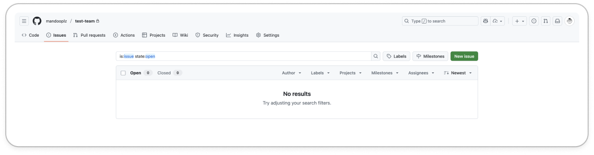

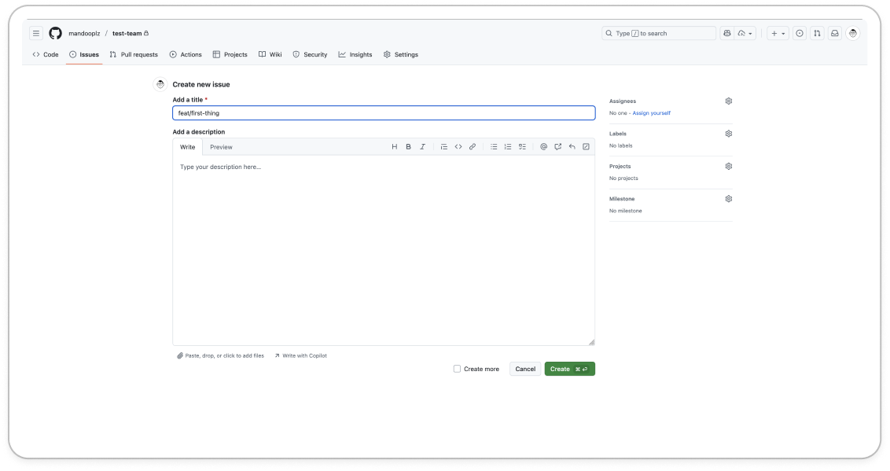

#### 2. Assignees 할당 & Create a branch

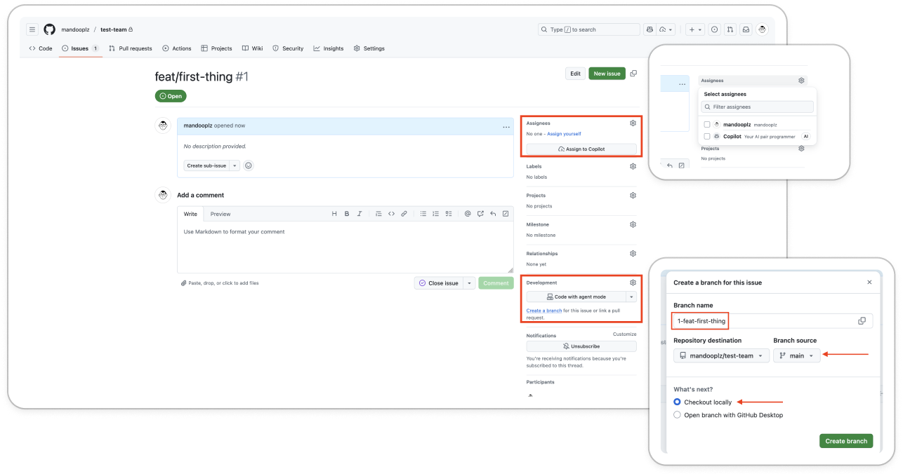

#### 3. 로컬 리포지토리에 브랜치 생성

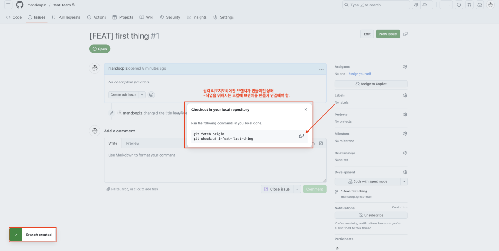
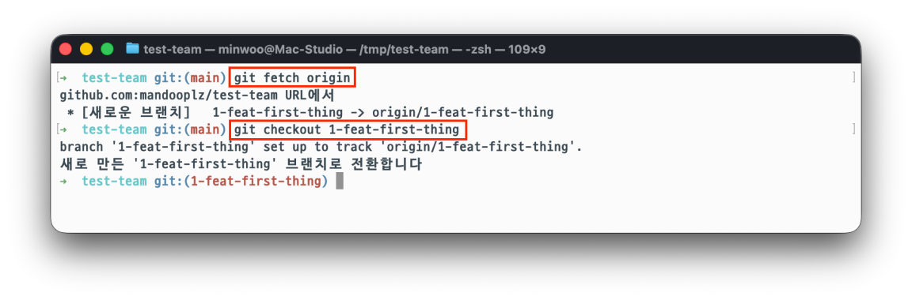
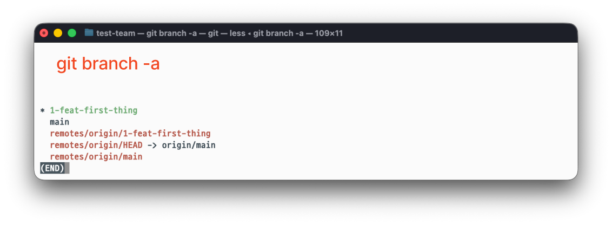

#### 4. 작업 내용 푸시

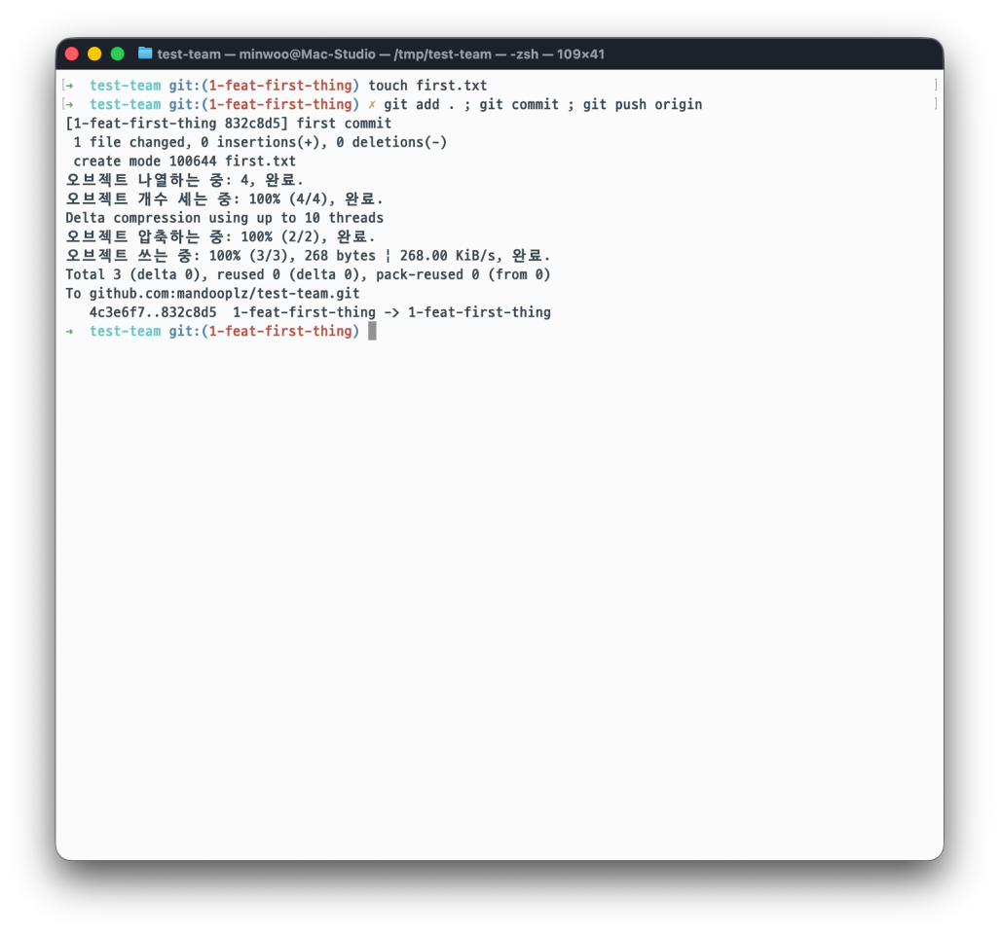

#### 5. 웹페이지에서 PR 생성

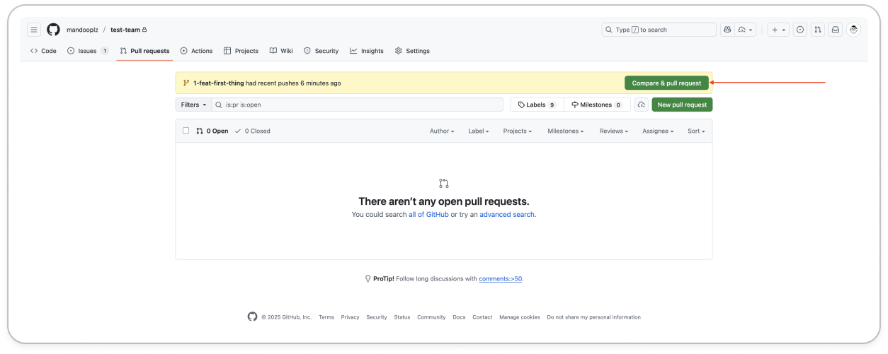

#### 6. Reviewer & Assignees 할당

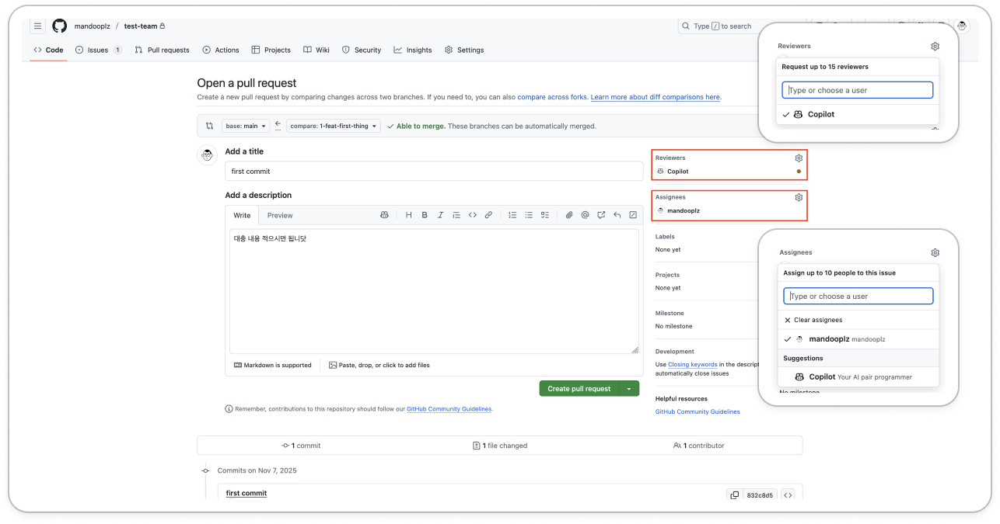

#### 7. PR 병합

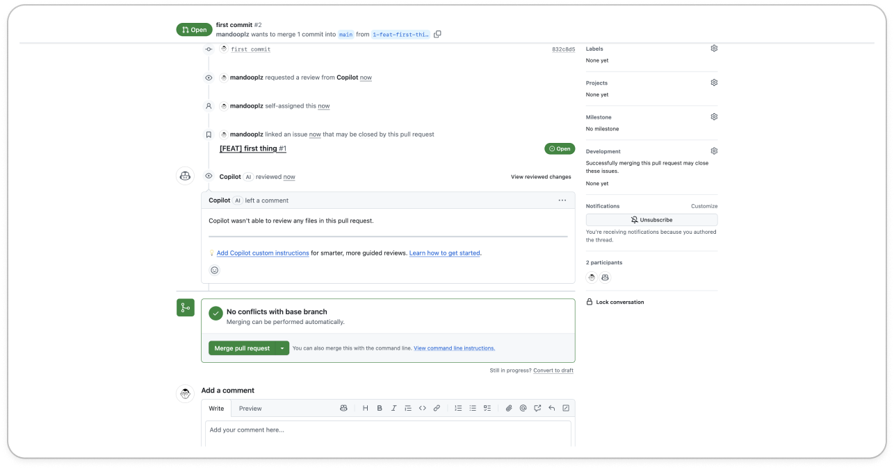
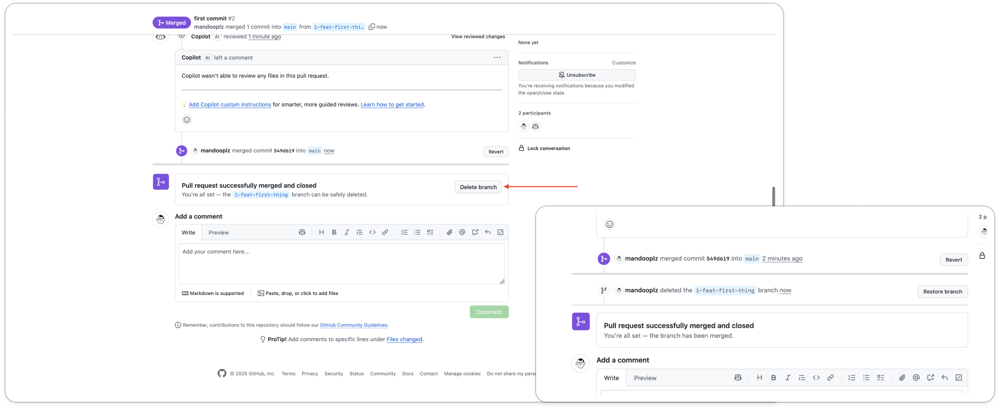

#### 8. 로컬 브랜치 삭제

```bash
# 로컬 브랜치 삭제
git branch -d <branch-name>
```

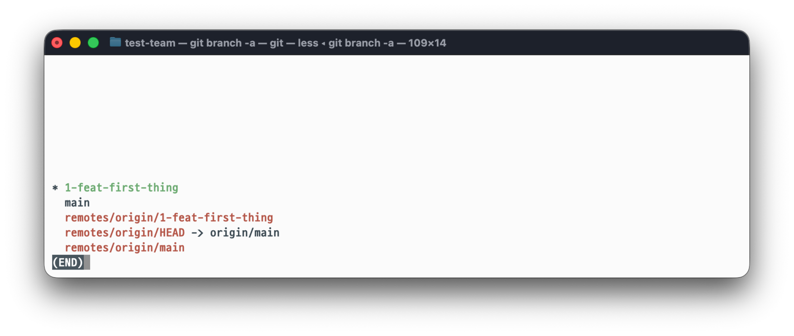
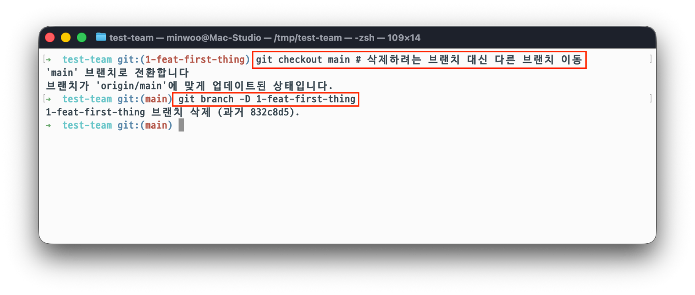
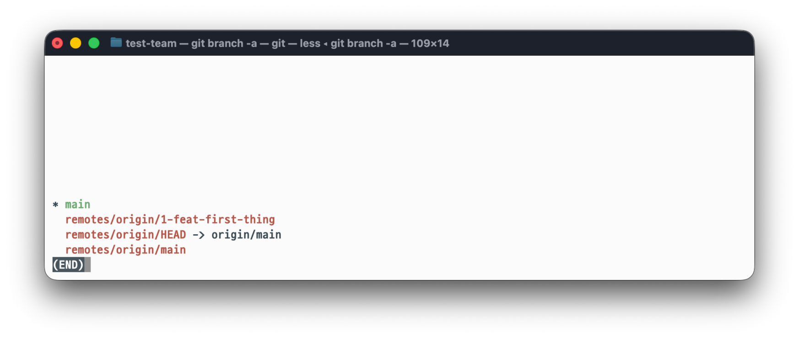

#### 9. 로컬에서 원격 추적 브랜치 삭제

```bash
# 원격 추적 브랜치 삭제
git fetch -p origin
```

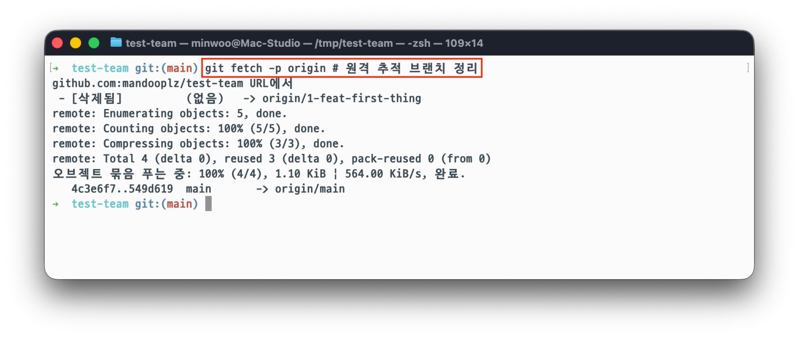
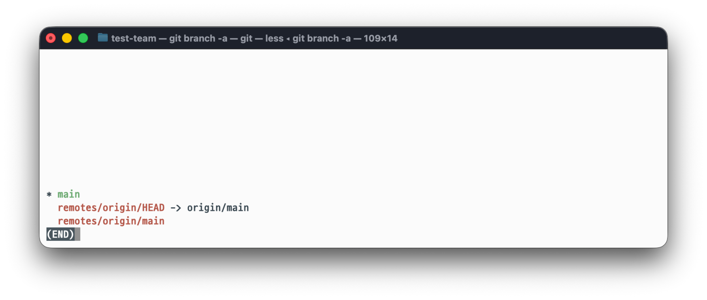

## GitHub CLI 활용

### GitHub CLI 시작하기

GitHub CLI는 명령줄에서 GitHub 작업을 수행할 수 있는 공식 도구입니다. 이를 활용하면 GitHub Issue를 좀 더 간단히 생성할 수 있습니다.

macOS를 사용한다면, Homebrew를 통해 설치할 수 있습니다.

```bash
$ brew install gh

# 이미 설치되어 있다면 최신 버전으로 업데이트합니다.
$ brew upgrade gh
```

GihHub CLI를 설치한 후에는 인증이 필요합니다. 이는 로컬 환경을 GitHub 계정과 연결해, CLI가 권한을 가진 상태로 Issue나 Pull Request를 생성할 수 있게 하기 위함입니다.

```bash
$ gh auth login
? What account do you want to log into? GitHub.com
? What is your preferred protocol for Git operations? HTTPS
? Authenticate Git with your GitHub credentials? Yes
? How would you like to authenticate GitHub CLI? Login with a web browser
# 브라우저에서 코드를 입력하거나, Personal Access Token을 사용할 수 있습니다.
```

### GitHub CLI로 Issue 관리

```bash
# 현재 원격 리포지토리로부터 이슈 목록을 가져옵니다.
gh issue list

# 터미널로 간단히 이슈를 생성합니다.
gh issue create

# 123번 이슈 상세 조회
gh issue view 123

# 나에게 할당된 이슈 확인
gh issue status
```
